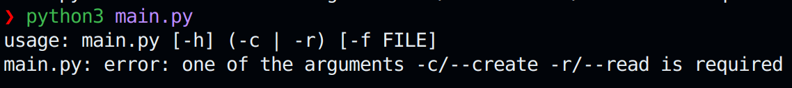

# Übung

**Python**

Wir wollen ein einfaches Formularprogramm schreiben, welches mittels Terminalbefehlen eine Formulardatei erzeugt und diese wieder lesen kann.

---

---

# Quellcode

https://l.itsnameless.de/pyrepo

---

# Hinweise

> Versuche möglichst immer, Type Annotations für die Argumente und Rückgabewerte von Funktionen zu nutzen.

---

# Aufgabe 1

> Zunächst benötigen wir ein Modul, in welchem wir unser Projekt erstellen.

---

### Grundlagen

1. Erstelle ein Python Modul (aka. eine Python Datei) mit dem Namen `assistant.py` im Ordner `formular`.
2. Erstelle eine Methode `run()` welche keine Argumente erhält und zunächst einfach `Hello, Formular Assistant!` auf der Konsole ausgibt.
3. Erstelle im root-Verzeichnis eine Datei `main.py` und importiere die `run()`-Methode aus `assistant.py`. Führe diese aus und teste den Code.

---

# Aufgabe 2

> Nun benötigen wir eine Möglichkeit, den Nutzer ein Formular erstellen zu lassen. Dafür wollen wir dem Nutzer Fragen stellen.

---

### Input, Schleifen

1. Erstelle eine Funktion `ask_for_form()`, welche keine Argumente erhält und dem Nutzer die Möglichkeit gibt, Fragen für ein Formular einzugeben.
    - Schreibe einen entsprechenden Docstring.
2. Frage den Nutzer wiederholt `Gib eine Frage ein (oder 'fertig' zum Beenden):`
    - wenn der Nutzer `fertig` schreibt, brich aus der Schleife ab
    - wenn der Nutzer etwas anderes schreibt, speichere die Frage in einer Liste.
3. gebe am Ende die Liste zurück.
4. Führe die Funktion in `run()` aus:
    - Speichere die Fragen dort in einer Variablen
    - gib diese zunächst auf der Konsole aus.
5. Teste den Code.

---

# Aufgabe 3

> Jetzt möchten wir die Fragen in einer Datei speichern, damit der Nutzer diese ausfüllen kann.

---

### Dateien Schreiben

1. Erstelle eine Funktion `create_form()`, welche eine Liste `questions` und einen Dateinamen `filename` erhält:
    - Ist der Dateiname nicht gegeben, soll dieser `form.txt` betragen.
2. Öffne die Datei `filename` im Schreibmodus (`w`) mittels eines Kontext-Managers (`with`).
3. Schreibe nun jede Frage in eine neue Zeile, wobei die Antwort mittels eines `:` separiert werden soll:
    - `Frage? : \n`
    - **Bonus**: Nutze `f`-Strings.
4. Teste die Funktion.

---

# Aufgabe 4

> Jetzt möchten wir die Antworten extrahieren und auf der Konsole ausgeben können.

---

### Dateien Lesen

1. Erstelle eine Funktion `read_form()`, welche einen Dateinamen `filename` erhält:
    - Ist der Dateiname nicht gegeben, soll dieser `form.txt` betragen.
2. Öffne die Datei `filename` im Lesemodus (`r`) mittels eines Kontext-Managers.
3. Erstelle ein Dictionary `answers`, welches als Key die Fragen und als Value die jeweilige Antwort erhalten soll.

---

### For-Schleifen, String-Operationen

1. Lies nun die Datei Zeile für Zeile aus:
    - Stelle sicher, dass Leerzeichen, Tabs, Newlines, ... entfernt werden (`strip()`)
    - Separiere die Zeilen entsprechend deinem Trenner (`split()`)
    - Speichere die Werte im Dictionary (Frage als `key`, Antwort als `value`).
2. Gib das Dictionary zurück.
3. Teste die Funktion und gib die Daten zunächst auf der Konsole aus.
    - Kommentiere die Aufrufe von `ask_for_form()` und `create_form()` aus, um nur `read_form()` zu nutzen.
    - Beachte: Vor dem Ausführen musst du die Fragen beantworten!

---

# Aufgabe 5

> Es ist umständlich, ständig im Code das Erstellen und Lesen Ein- und Auszukommentieren. Dafür können wir aber Terminal-Argumente nutzen!

---

### Argparse

1. Importiere das Modul `argparse` und erstelle in `run()` einen neuen `parser` mit der `description` "Formular Assistant".
2. Erstelle eine mutually-exclusive Gruppe, mit den Argumenten:
    - `-c (--create)` welches ein Boolean Value speichert, wenn die Flag existiert (`action="store_true"`)
    - `-r (--read)` welches ein Boolean Value speichert, wenn die Flag existiert.
3. Füge dem Parser nun noch ein Argument (`-f (--file)`) hinzu:
    - der Type muss `str` sein
    - es muss optional mit dem Default-Value `form.txt` sein.

---

### Argparse

4. Lies nun die Argumente aus (`parse_args()`).
5. Bei der Flag `-c`:
    - Frage den Nutzer nach Fragen
    - Speichere die Fragen ab
    - Schreibe "Formular erstellt."
6. Bei der Flag `-r`:
    - Lies das Formular aus
    - Iteriere über die Fragen und Antworten und gib diese wie folgt aus:
        - Format `- Frage : Antwort`
        - Fragen in Großbuchstaben
7. Teste dein Programm.

---

# Feedback

Hat euch diese Stunde sehr gut gefallen? War sie absolut schrecklich? Das ist mir _nicht_ egal! Also lasst Feedback da!

https://l.itsnameless.de/practice

---

# Vielen Dank für eure Aufmerksamkeit!

https://social.itsnameless.de

